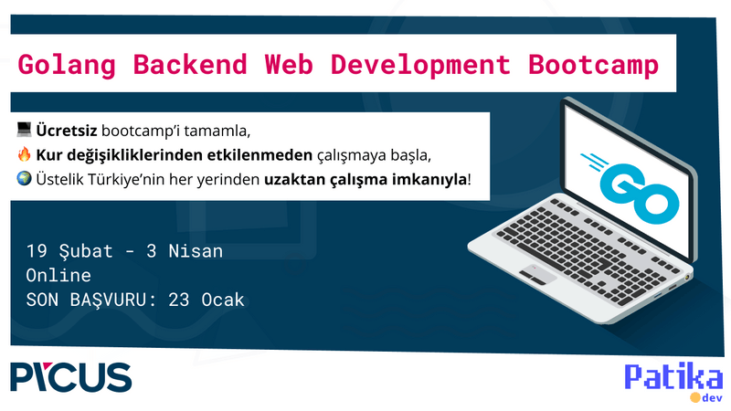
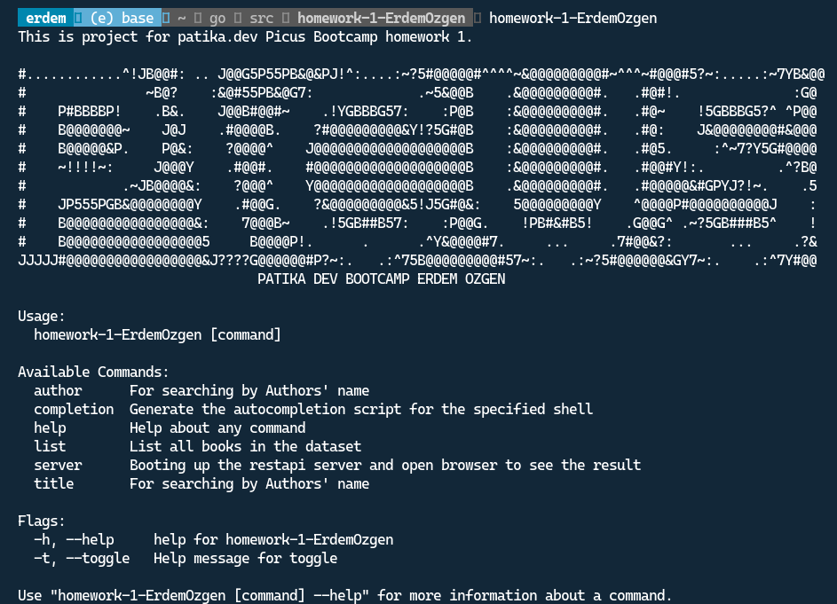
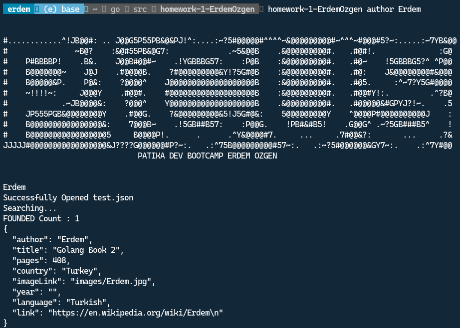
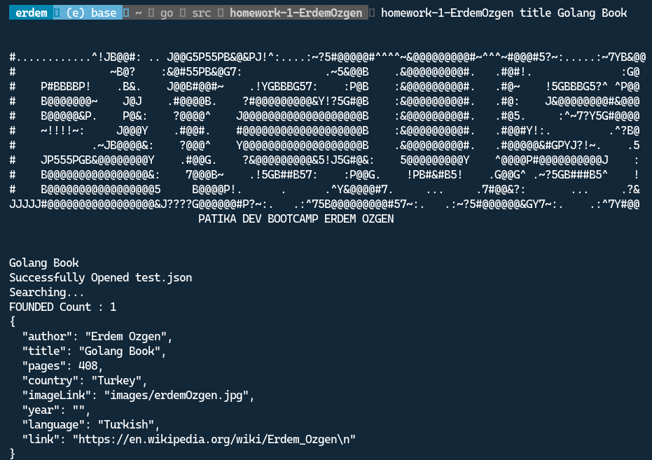
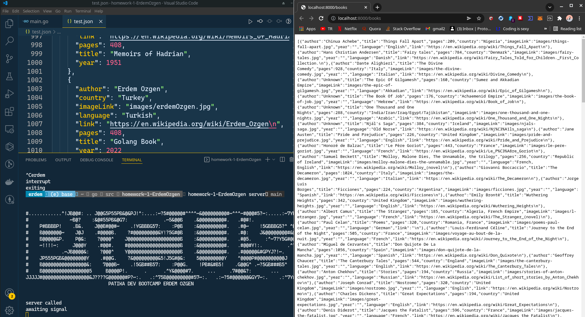

# homework-1-ErdemOzgen


This is first assignment for picus patika.dev.

# How to install ?

```bash
go get ./...
go install 
homework-1-ErdemOzgen

```

# How it works ?

1. Use this for help functionality
```bash
homework-1-ErdemOzgen -h
```


2. Use this for search by author name
```bash
homework-1-ErdemOzgen author Erdem # Change Erdem to other author name.
```


3. Use this for search by title of book
```bash
homework-1-ErdemOzgen author Golang Book # Change Golang Book to other book name.
```



4. Use this for list all books
```bash
homework-1-ErdemOzgen list 
```


5. Use this create server and get all functionality with Rest API
```bash
homework-1-ErdemOzgen server
```



### Docker file for docker buildings 

```bash

docker build -t homework-1-ErdemOzgen .

```


```dockerfile
FROM golang

WORKDIR $GOPATH/src/homework-1-ErdemOzgen

COPY . .

RUN go get -d -v ./...
RUN go install -v ./...
RUN go build -o .

EXPOSE 8000:8000

CMD ["homework-1-ErdemOzgen server"]

```
